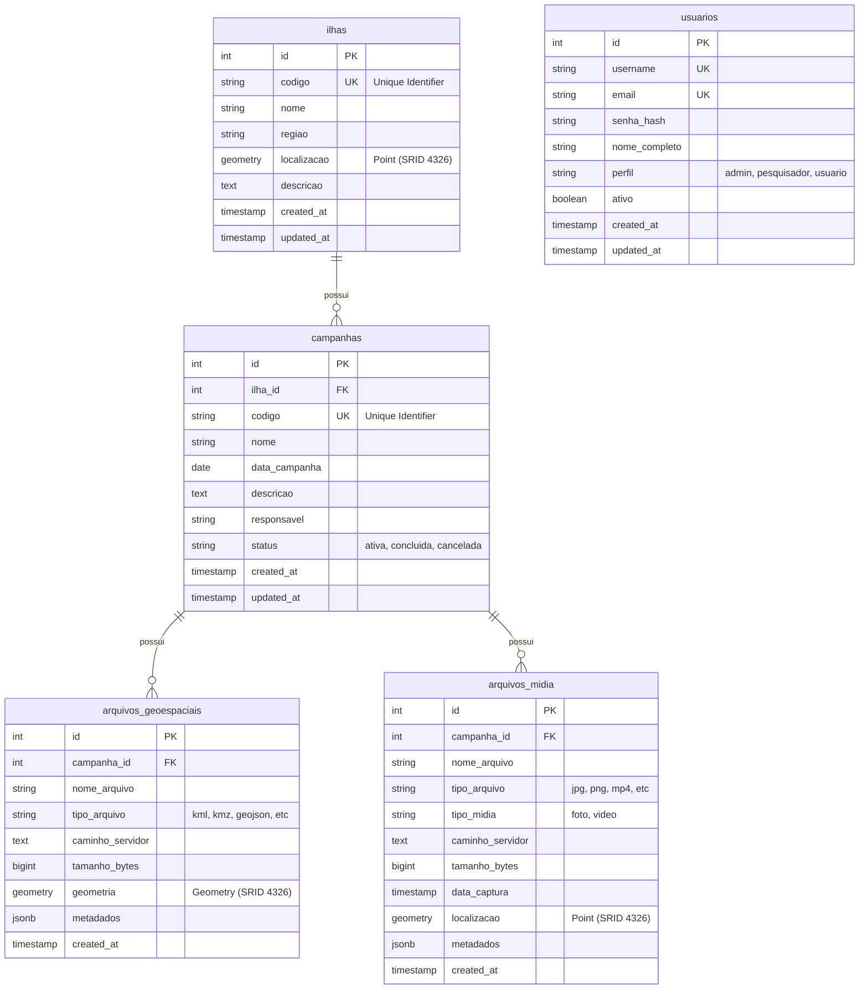

# Diagrama Entidade-Relacionamento

```mermaid
erDiagram
    ilhas {
        int id PK
        string codigo UK "Unique Identifier"
        string nome
        string regiao
        geometry localizacao "Point (SRID 4326)"
        text descricao
        timestamp created_at
        timestamp updated_at
    }

    campanhas {
        int id PK
        int ilha_id FK
        string codigo UK "Unique Identifier"
        string nome
        date data_campanha
        text descricao
        string responsavel
        string status "ativa, concluida, cancelada"
        timestamp created_at
        timestamp updated_at
    }

    arquivos_geoespaciais {
        int id PK
        int campanha_id FK
        string nome_arquivo
        string tipo_arquivo "kml, kmz, geojson, etc"
        text caminho_servidor
        bigint tamanho_bytes
        geometry geometria "Geometry (SRID 4326)"
        jsonb metadados
        timestamp created_at
    }

    arquivos_midia {
        int id PK
        int campanha_id FK
        string nome_arquivo
        string tipo_arquivo "jpg, png, mp4, etc"
        string tipo_midia "foto, video"
        text caminho_servidor
        bigint tamanho_bytes
        timestamp data_captura
        geometry localizacao "Point (SRID 4326)"
        jsonb metadados
        timestamp created_at
    }

    usuarios {
        int id PK
        string username UK
        string email UK
        string senha_hash
        string nome_completo
        string perfil "admin, pesquisador, usuario"
        boolean ativo
        timestamp created_at
        timestamp updated_at
    }

    ilhas ||--o{ campanhas : "possui"
    campanhas ||--o{ arquivos_geoespaciais : "possui"
    campanhas ||--o{ arquivos_midia : "possui"
```
