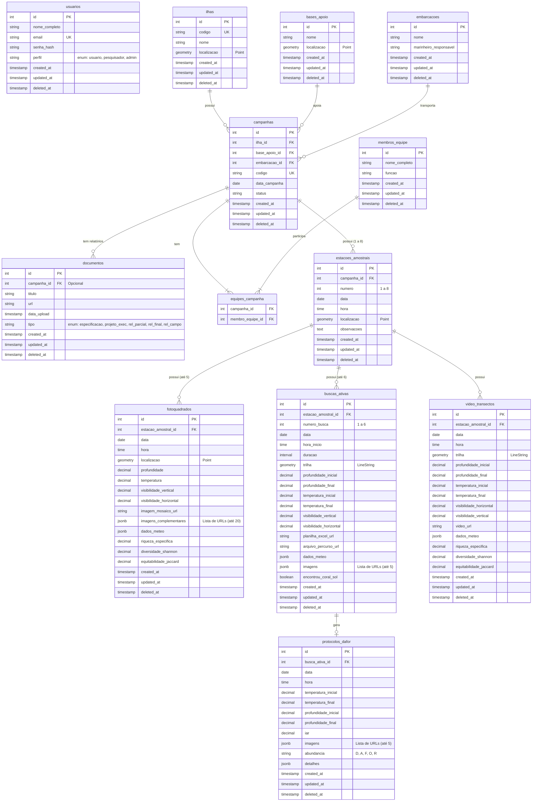

# Diagrama Entidade-Relacionamento (Proposta v8)

Incorpora **Soft Delete** (`deleted_at`) e **Timestamps** (`created_at`, `updated_at`) em todas as tabelas. Restaura a tabela **Usuários**.

```mermaid
erDiagram
    usuarios {
        int id PK
        string nome_completo
        string email UK
        string senha_hash
        string perfil "enum: usuario, pesquisador, admin"
        timestamp created_at
        timestamp updated_at
        timestamp deleted_at
    }

    bases_apoio {
        int id PK
        string nome
        geometry localizacao "Point"
        timestamp created_at
        timestamp updated_at
        timestamp deleted_at
    }

    embarcacoes {
        int id PK
        string nome
        string marinheiro_responsavel
        timestamp created_at
        timestamp updated_at
        timestamp deleted_at
    }

    membros_equipe {
        int id PK
        string nome_completo
        string funcao
        timestamp created_at
        timestamp updated_at
        timestamp deleted_at
    }

    documentos {
        int id PK
        int campanha_id FK "Opcional"
        string titulo
        string url
        timestamp data_upload
        string tipo "enum: especificacao, projeto_exec, rel_parcial, rel_final, rel_campo"
        timestamp created_at
        timestamp updated_at
        timestamp deleted_at
    }

    ilhas {
        int id PK
        string codigo UK
        string nome
        geometry localizacao "Point"
        timestamp created_at
        timestamp updated_at
        timestamp deleted_at
    }

    campanhas {
        int id PK
        int ilha_id FK
        int base_apoio_id FK
        int embarcacao_id FK
        string codigo UK
        date data_campanha
        string status
        timestamp created_at
        timestamp updated_at
        timestamp deleted_at
    }

    equipes_campanha {
        int campanha_id FK
        int membro_equipe_id FK
    }

    estacoes_amostrais {
        int id PK
        int campanha_id FK
        int numero "1 a 8"
        date data
        time hora
        geometry localizacao "Point"
        text observacoes
        timestamp created_at
        timestamp updated_at
        timestamp deleted_at
    }

    fotoquadrados {
        int id PK
        int estacao_amostral_id FK
        date data
        time hora
        geometry localizacao "Point"
        decimal profundidade
        decimal temperatura
        decimal visibilidade_vertical
        decimal visibilidade_horizontal
        string imagem_mosaico_url
        jsonb imagens_complementares "Lista de URLs (até 20)"
        jsonb dados_meteo
        decimal riqueza_especifica
        decimal diversidade_shannon
        decimal equitabilidade_jaccard
        timestamp created_at
        timestamp updated_at
        timestamp deleted_at
    }

    buscas_ativas {
        int id PK
        int estacao_amostral_id FK
        int numero_busca "1 a 6"
        date data
        time hora_inicio
        interval duracao
        geometry trilha "LineString"
        decimal profundidade_inicial
        decimal profundidade_final
        decimal temperatura_inicial
        decimal temperatura_final
        decimal visibilidade_vertical
        decimal visibilidade_horizontal
        string planilha_excel_url
        string arquivo_percurso_url
        jsonb dados_meteo
        jsonb imagens "Lista de URLs (até 5)"
        boolean encontrou_coral_sol
        timestamp created_at
        timestamp updated_at
        timestamp deleted_at
    }

    protocolos_dafor {
        int id PK
        int busca_ativa_id FK
        date data
        time hora
        decimal temperatura_inicial
        decimal temperatura_final
        decimal profundidade_inicial
        decimal profundidade_final
        decimal iar
        jsonb imagens "Lista de URLs (até 5)"
        string abundancia "D, A, F, O, R"
        jsonb detalhes
        timestamp created_at
        timestamp updated_at
        timestamp deleted_at
    }

    video_transectos {
        int id PK
        int estacao_amostral_id FK
        date data
        time hora
        geometry trilha "LineString"
        decimal profundidade_inicial
        decimal profundidade_final
        decimal temperatura_inicial
        decimal temperatura_final
        decimal visibilidade_horizontal
        decimal visibilidade_vertical
        string video_url
        jsonb dados_meteo
        decimal riqueza_especifica
        decimal diversidade_shannon
        decimal equitabilidade_jaccard
        timestamp created_at
        timestamp updated_at
        timestamp deleted_at
    }

    ilhas ||--o{ campanhas : "possui"
    bases_apoio ||--o{ campanhas : "apoia"
    embarcacoes ||--o{ campanhas : "transporta"
    campanhas ||--o{ documentos : "tem relatórios"
    
    campanhas ||--|{ equipes_campanha : "tem"
    membros_equipe ||--|{ equipes_campanha : "participa"

    campanhas ||--o{ estacoes_amostrais : "possui (1 a 8)"
    
    estacoes_amostrais ||--o{ fotoquadrados : "possui (até 5)"
    estacoes_amostrais ||--o{ buscas_ativas : "possui (até 6)"
    estacoes_amostrais ||--o{ video_transectos : "possui"
    
    buscas_ativas ||--o| protocolos_dafor : "gera"
```
